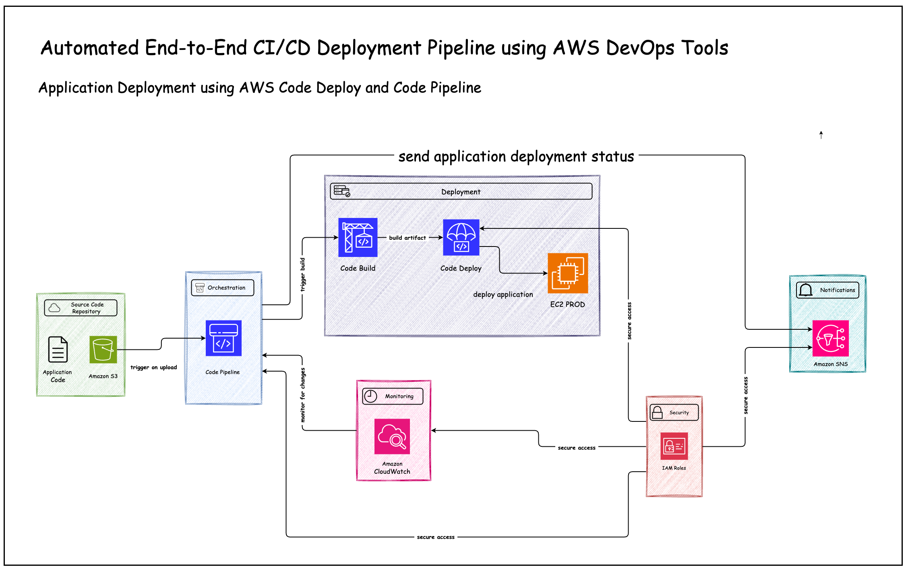

# Building a Robust End-to-End CI/CD Pipeline with AWS DevOps Tools

I am excited to share that I have built a fully automated, scalable End-to-End CI/CD pipeline using AWS DevOps tools. This project streamlines application delivery from code upload to deployment, ensuring zero-downtime updates, faster release cycles, and robust scalability while adhering to AWS best practices.

## Key AWS Services Used and Features
- ✅ **Amazon S3**: Serves as a centralized, version-controlled repository for application code, enabling easy rollbacks.
- ✅ **AWS CodePipeline**: Orchestrates the CI/CD workflow, seamlessly connecting all stages of the deployment process.
- ✅ **AWS CodeBuild**: Handles continuous integration by compiling code and generating reliable artifacts.
- ✅ **AWS CodeDeploy**: Automates application deployment to EC2 instances, ensuring consistent and zero-downtime updates.
- ✅ **Amazon CloudWatch**: Monitors deployment events and logs pipeline activities, providing real-time visibility.
- ✅ **Amazon SNS**: Sends real-time notifications about deployment events, improving communication and collaboration.
- ✅ **IAM Roles**: Ensures secure communication between services by enforcing fine-grained access controls.

## Key Features and Functionality
- 🟠 **Automated Deployments**: Triggered automatically when new code is uploaded to S3, reducing manual effort.
- 🟠 **Continuous Integration and Deployment**: CodeBuild and CodeDeploy ensure error-free builds and zero-downtime deployments.
- 🟠 **Version Control and Rollbacks**: S3 versioning enables seamless rollbacks to previous stable releases.
- 🟠 **Scalability and Reliability**: Designed to handle increasing demands, ensuring consistent performance and availability.
- 🟠 **Real-Time Monitoring**: CloudWatch provides actionable insights, while SNS keeps stakeholders informed.

## Key Outcomes
- 🟣 **Accelerated Release Cycles**: Faster deployments enable quicker updates and improved time-to-market.
- 🟣 **Enhanced Stability**: Automatic rollbacks and zero-downtime updates ensure application reliability.
- 🟣 **Improved Transparency**: Real-time notifications and detailed logs keep the process auditable and visible.
- 🟣 **Scalable and Future-Ready**: Built to accommodate future application and infrastructure growth.

## Takeaways
- 💡 **Mastering Automation**: Reinforced the importance of automation in delivering faster, error-free deployments.
- 💡 **AWS Expertise**: Strengthened my knowledge of CodePipeline, CodeBuild, CodeDeploy, and related tools.
- 💡 **Scalable Solutions**: Showcased the ability to design robust and scalable CI/CD workflows.
- 💡 **Real-World Problem Solving**: Addressed deployment challenges with effective, cloud-native solutions.

## 🟢 Let’s Connect!
If you’re passionate about DevOps or curious about AWS automation, let’s connect! I’d love to exchange ideas, discuss strategies, or collaborate on exciting projects. Drop your thoughts in the comments!

Feel free to connect with me on [LinkedIn](https://www.linkedin.com/in/vignesh-aws-devops/)
